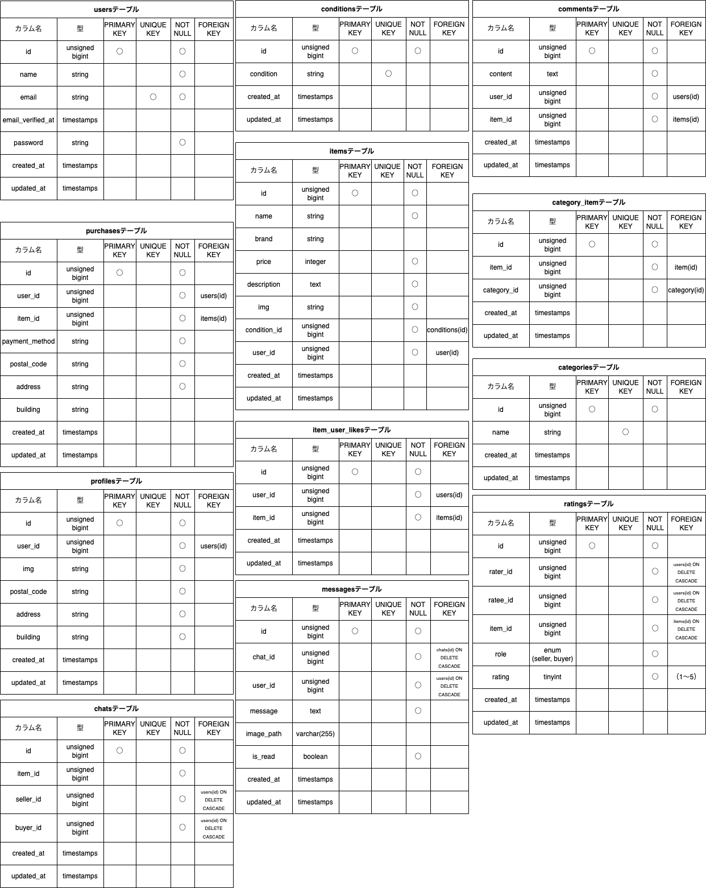
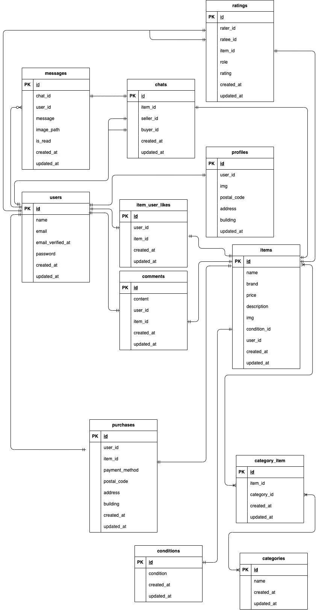

# coachtech フリマ

ある企業が開発した独自のフリマアプリ

## 作成した目的

アイテムの出品と購入を行うためのフリマアプリを開発する

## 機能一覧

- 新規会員登録
- ログイン
- メール認証機能:会員登録時とログイン時（MailHog）
- ログアウト
- プロフィール設定
- 商品の出品
- 商品の詳細表示
- 商品に対して『いいね』
- 商品に対してコメント送信
- 商品の検索
- 『いいね』した商品の表示（マイリスト）
- 出品した商品の一覧（マイページ）
- 商品の購入
- 配送先の変更
- 購入した商品の一覧（マイページ）
- テストケース
<!-- 以下、プロ入会テスト要件 -->
- 取引チャット（商品詳細ページ、マイページからチャットページに遷移可能）
- 商品を購入すると『取引中の商品』に登録
- 送信済みメッセージの編集・削除機能
- 取引評価（購入者が評価したらメールで通知）
- 評価平均確認機能（マイページに表示）

## 使用技術(実行環境)

- PHP7.4.9
- Laravel8.83.29
- MySQL15.1
- MailHog

## テーブル設計



## ER 図



## 環境構築

**Docker ビルド**

1. https://github.com/youhonami/furima.git

- ターミナルで git clone git@git@github.com:youhonami/furima.git を実行

  - リモートリポジトリを作成
  - ターミナルで git remote set-url origin 新規リポジトリの紐付け先リンク　を実行
  - ターミナルで git remote -v を実行。変更を確認。
  - ローカルリポジトリの変更を新しいリモートリポジトリに反映

  ```
  git status
  git add .
  git commit -m "例：リモートリポジトリの変更"
  git push origin main
  ```

2. DockerDesktop アプリを立ち上げる
3. `docker-compose up -d --build`

> _Mac の M1・M2 チップの PC の場合、`no matching manifest for linux/arm64/v8 in the manifest list entries`のメッセージが表示されビルドができないことがあります。
> エラーが発生する場合は、docker-compose.yml ファイルの「mysql」内に「platform」の項目を追加で記載してください_

```bash
mysql:
    platform: linux/x86_64(この文追加)
    image: mysql:8.0.26
    environment:
```

**Laravel 環境構築**

1. `docker-compose exec php bash`
2. `composer install`
   > \_composer install に失敗する場合は、laravel/sail を個別にインストールしてみてください。`composer require laravel/sail --dev`その後`composer install`
3. 「.env.example」ファイルを 「.env」ファイルに命名を変更。または、新しく.env ファイルを作成
4. .env に以下の環境変数を追加

```
DB_CONNECTION=mysql
DB_HOST=mysql
DB_PORT=3306
DB_DATABASE=laravel_db
DB_USERNAME=laravel_user
DB_PASSWORD=laravel_pass

MAIL_FROM_ADDRESS=認証メールの送信元となるメールアドレスを入力してください
```

5. アプリケーションキーの作成

```bash
php artisan key:generate
```

6. マイグレーションの実行

```bash
php artisan migrate
```

7. シーディングの実行

```bash
php artisan db:seed
```

8. ストレージのシンボリックリンクを作成

```bash
php artisan storage:link
```

9. Stripe API 設定
   **Stripe の管理画面** から API キーを取得してください。
   `.env` ファイルを開き、以下のように設定してください。

```bash
STRIPE_KEY=sk_test_あなたのAPIキー
STRIPE_SECRET=sk_test_あなたのシークレットキー
```

10. テストケース(PHPUnit) 設定

```
docker-compose exec mysql mysql -u root -p
パスワードが求められたら root と記入
CREATE DATABASE demo_test;

docker-compose exec php bash
php artisan migrate --env=testing --seed
php artisan test
```

## URL

- 開発環境:http://localhost
- phpMyAdmin:http://localhost:8080/
- MailHog:http://localhost:8025/
